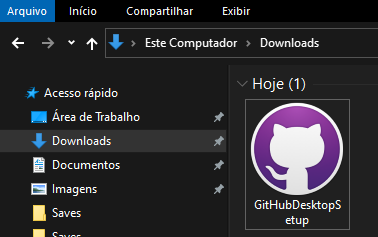
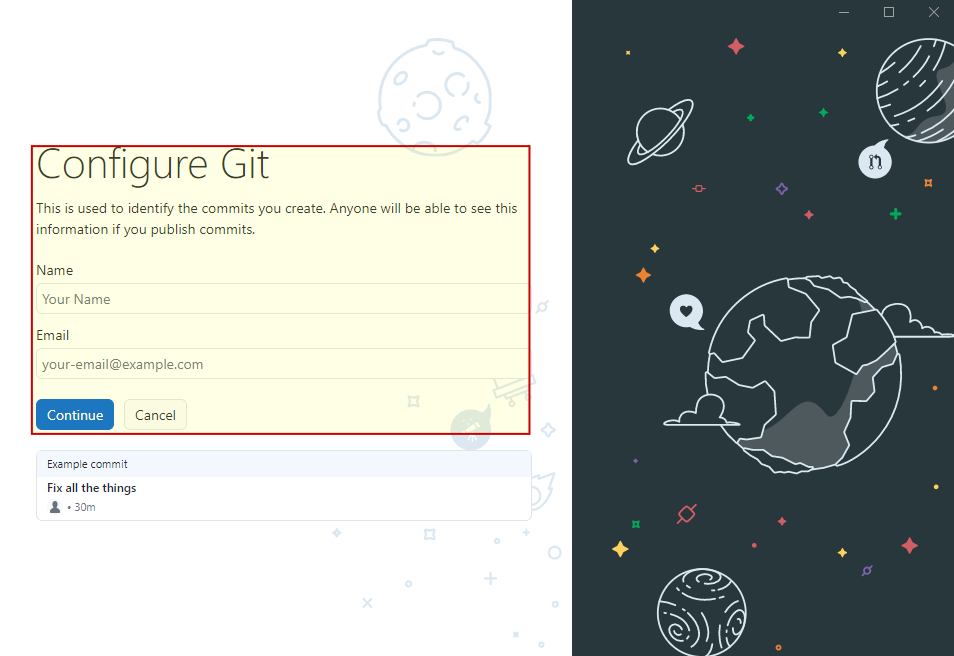
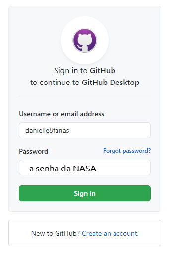
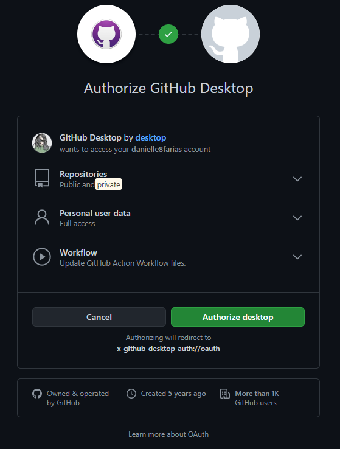
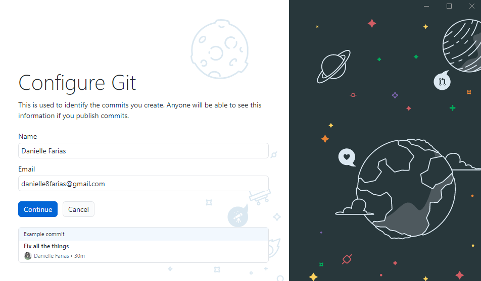
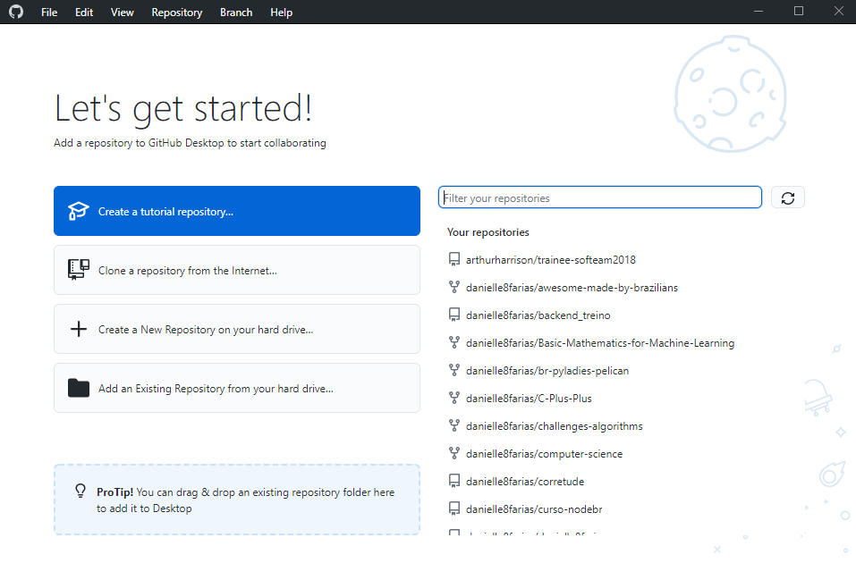

# Instalação do GitHub Desktop para Windows

Algumas pessoas se sentem desconfortáveis com a linha de comando. E está tudo bem com isso. Já avançamos muito na computação, não apenas para tornar o ambiente mais agradável para a usuária, como também para a desenvolvedora. Por isso, para quem faz uso do GitHub como plataforma de repositório remoto, temos um **GitHub Desktop** que vem com a proposta de ser uma versão mais amigável de integração do Git e GitHub.

Para baixar o Github Desktop acesse o [site oficial](https://desktop.github.com/).

E clique no botão indicado na imagem. O **download** começará em seguida.

Após baixar o **instalador** execute-o para **começar a instalação**.

Será mostrado a seguinte imagem por alguns segundos

E em seguida a tela para que você faça o **login** com a **sua conta do GitHub**.

Caso você decida **não** fazer o login

ele irá para a tela de **configuração do Git**, que você deve preencher com seu nome e email.

Isso é importante para que seja **registrado** cada commit e modificações feitas nas **pastas e arquivos rastreados** pelo Git. Entretanto, desse modo, **não é possível** fazer uso do repositótio remoto **GitHub**. Todo versionamento será apenas local (na sua máquina).

Como queremos fazer a integração com o GitHub, vamos clicar para fazer o login.

Seremos redicionadas ao site para preencher com o **nome de usuário e senha** da nossa conta.

E será pedido a **autorização** do acesso a sua conta do GitHub.

Dada a autorização, o navegador pedirá a permissão para abrir o **GitHub Desktop**.

Só então iremos para a parte de **configuração do Git**.

Feita a configuração, chegamos a finalização do processo de instalação.

Agora o **GitHub Desktop** está pronto para uso.

